# Factory Design Pattern - UML Diagrams

## 1. Factory Pattern - Class Diagram

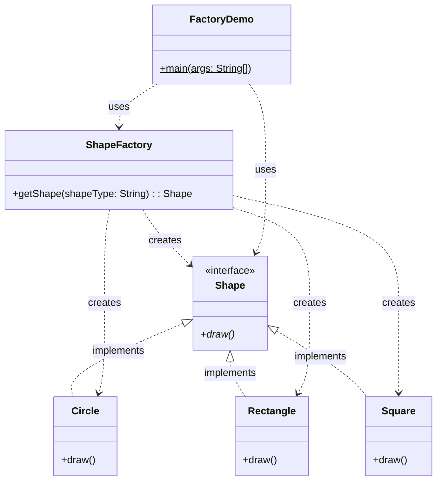

---

## 2. Sequence Diagram - Creating Shapes

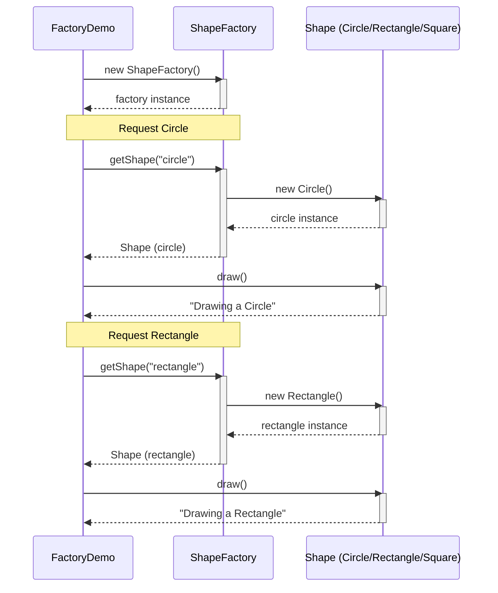

---

## 3. Factory Pattern Flow

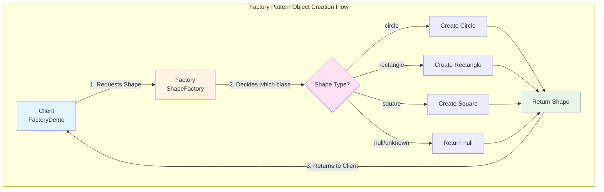

---

## 4. Factory Decision Logic

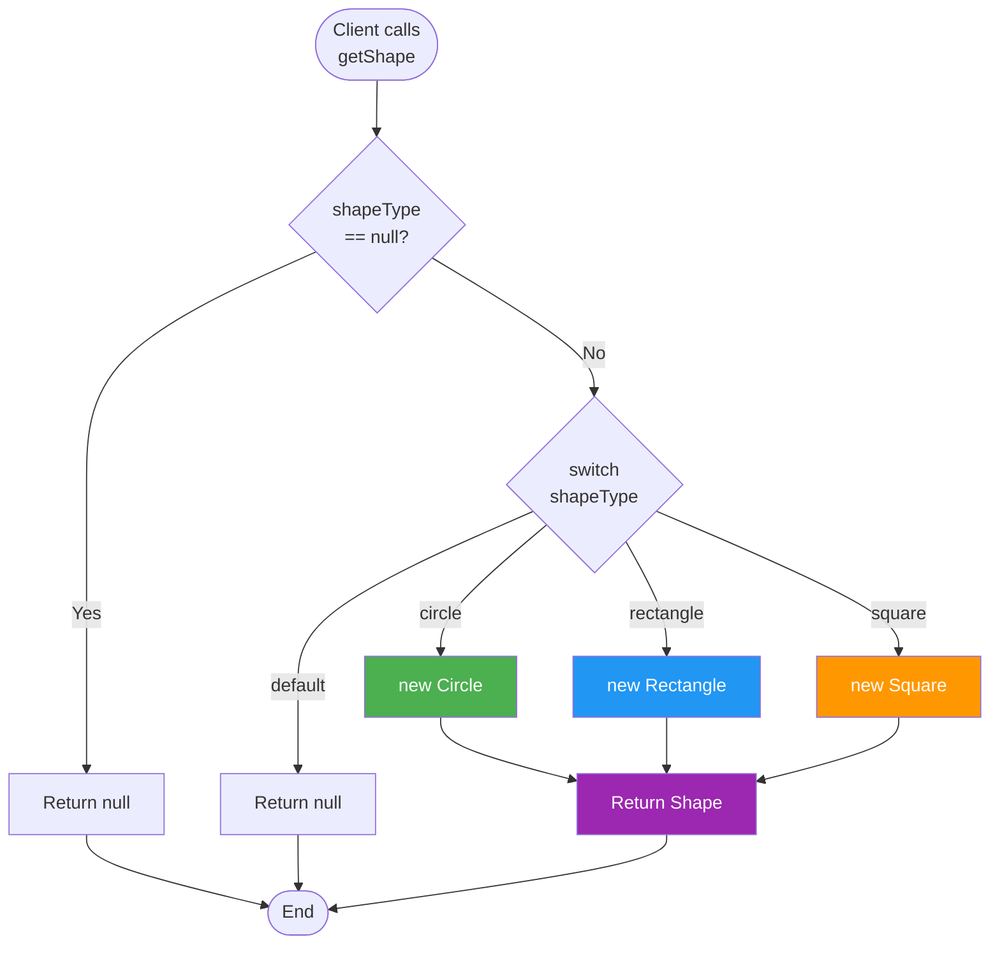

---

## 5. Object Creation Comparison

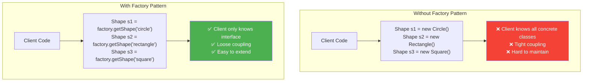

---

## 6. Design Explanation

### What is the Factory Pattern?

**Factory Pattern** is a creational design pattern that provides an interface for creating objects in a superclass, but allows subclasses to alter the type of objects that will be created. It encapsulates object creation logic.

### Key Components

1. **Product Interface (Shape)**:
   - Defines the interface for objects the factory creates
   - Common interface: `draw()` method
   - All concrete products implement this interface

2. **Concrete Products (Circle, Rectangle, Square)**:
   - Implement the Product interface
   - Provide specific implementations of `draw()`
   - Client doesn't need to know about these classes

3. **Factory (ShapeFactory)**:
   - Contains the creation logic
   - Method: `getShape(String shapeType)`
   - Decides which concrete class to instantiate
   - Returns Product interface type

4. **Client (FactoryDemo)**:
   - Uses factory to create objects
   - Works with Product interface only
   - Doesn't know about concrete implementations

---

## 7. How Your Code Works

### Step-by-Step Process

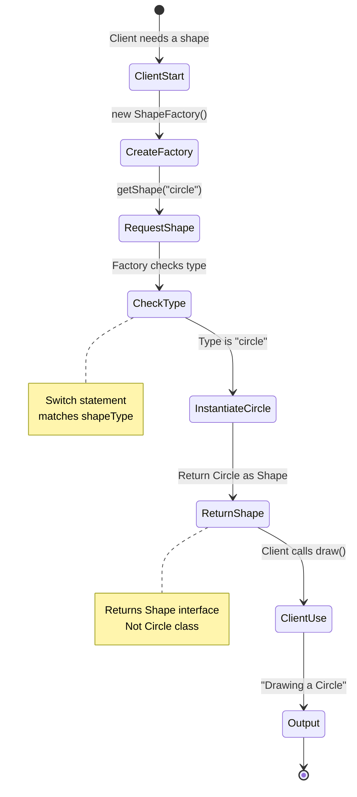

---

## 8. Factory Pattern Structure

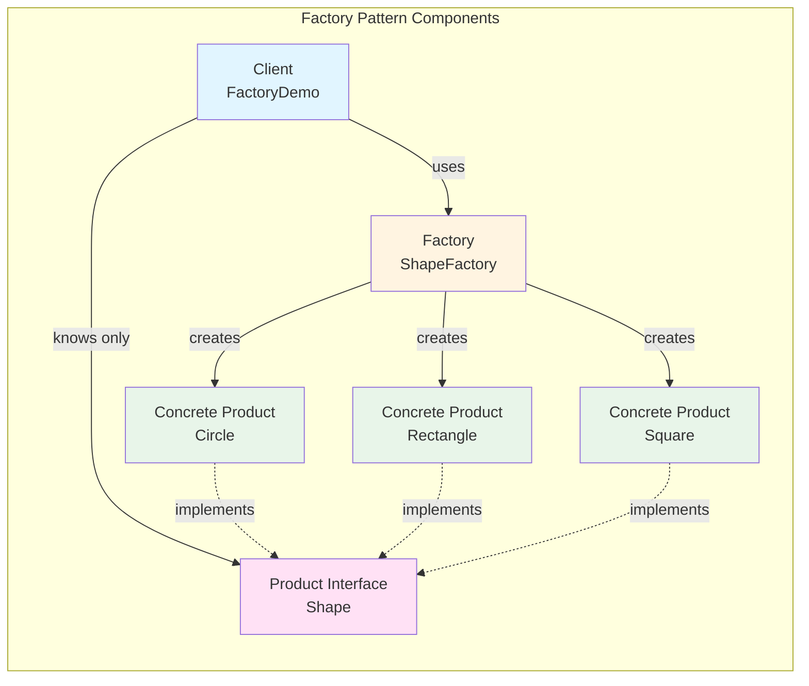

---

## 9. Advantages & Disadvantages

### ✅ Advantages

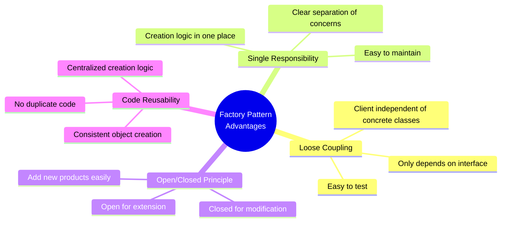

### ❌ Disadvantages

| Disadvantage | Description |
|-------------|-------------|
| **Complexity** | Adds extra layer of abstraction |
| **More Classes** | Need to create factory class |
| **String-based** | Type safety issues with string parameters |
| **Null Returns** | Must handle null for unknown types |

---

## 10. When to Use Factory Pattern

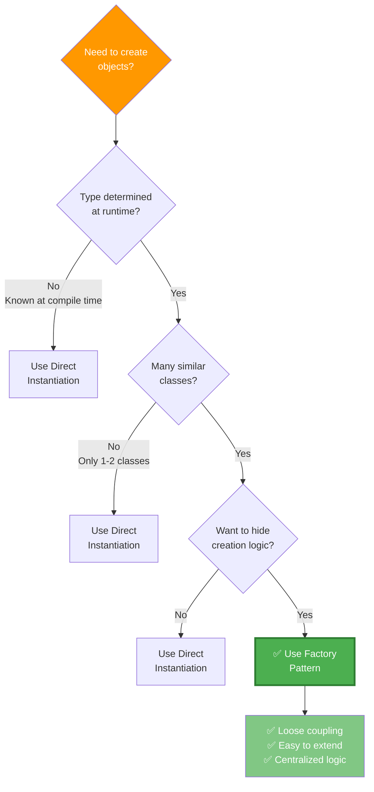

---

## 11. Real-World Examples

### Common Use Cases

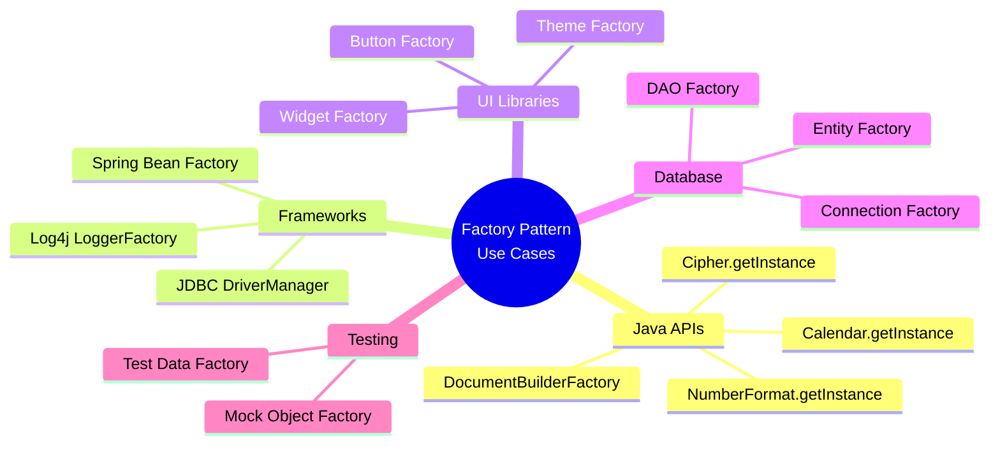

---

## 12. Extension Example - Adding New Shape

### Adding Triangle to Your Factory

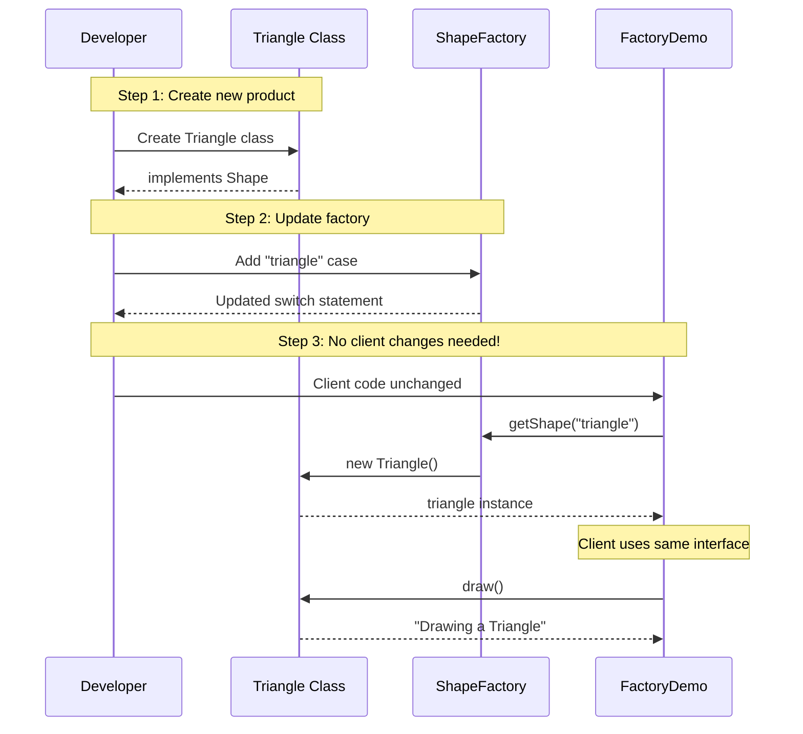

### Code to Add Triangle

```java
// 1. Create Triangle class
public class Triangle implements Shape {
    @Override
    public void draw() {
        System.out.println("Drawing a Triangle");
    }
}

// 2. Update ShapeFactory - Add one case
public class ShapeFactory {
    public Shape getShape(String shapeType) {
        if (shapeType == null) return null;
        
        switch (shapeType.toLowerCase()) {
            case "circle":
                return new Circle();
            case "rectangle":
                return new Rectangle();
            case "square":
                return new Square();
            case "triangle":  // NEW CASE
                return new Triangle();
            default:
                return null;
        }
    }
}

// 3. Client code - NO CHANGES NEEDED!
// Just use the new shape name
Shape shape4 = shapeFactory.getShape("triangle");
shape4.draw(); //
